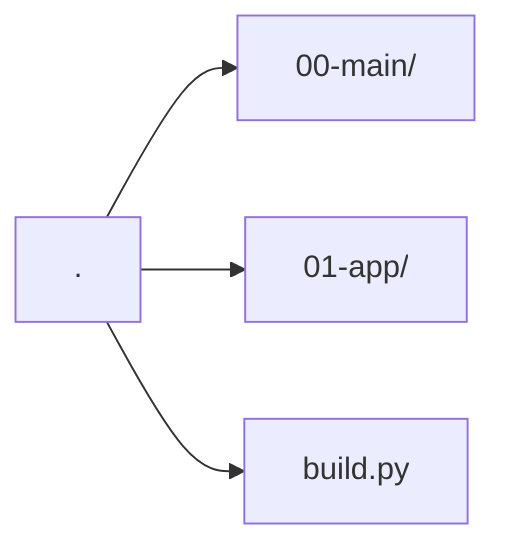

# Paradoc

[](https://anaconda.org/krande/paradoc)
[](https://anaconda.org/krande/paradoc)
[](https://anaconda.org/krande/paradoc)
[](https://anaconda.org/krande/paradoc)

A python library for parametric documentation based on markdown and pandoc. `paradoc` brings
some additional functionality to ensure improved end-formatting for .docx exports and integrating 
variable substitution. Use `{{__variable__}}` in your markdown files to insert any text prior to running pandoc.

Install using

```
conda install -c krande -c conda-forge paradoc
```

Note! This is still very early in development so expect things to break.


## Usage

Assuming you have a folder structure set up as this:


whereas `00-main` and `01-app` contains markdown (.md) files representing content in your
main and appendix respectively. Both `00-main` and `01-app` can contain as many subdirectories
as you prefer. The document order is simply the alphabetical order of subdirectories and naming of markdown files.

### Convert to a single Word DOCX

```python
# build.py

from paradoc import OneDoc

one = OneDoc()
one.compile("MyDocument.docx")
```

### Performing variable substitution

Assuming you have somewhere in any of your documents a variable `{{__val_gM__}}` the following
example will substitute that variable with the number 1.15.

```python
from paradoc import OneDoc

one = OneDoc()
one.variables["val_gM"] = 1.15
one.compile("MyDocument.docx")
```

### 

## For developers

For developers interested in contributing to this project feel free to 
make a fork, experiment and create a pull request when you have something you 
would like to add/change/remove. 

Before making a pull request you need to lint with, isort, flake8 and black.
Assuming you have a cmd terminal open in the repo directory you can
run

````
pip install black isort flake8
isort .
flake8 .
black .
````

Or if you have make installed you can just run `make format` 
to run all three tools at once.

## Project Responsible ###

	Kristoffer H. Andersen