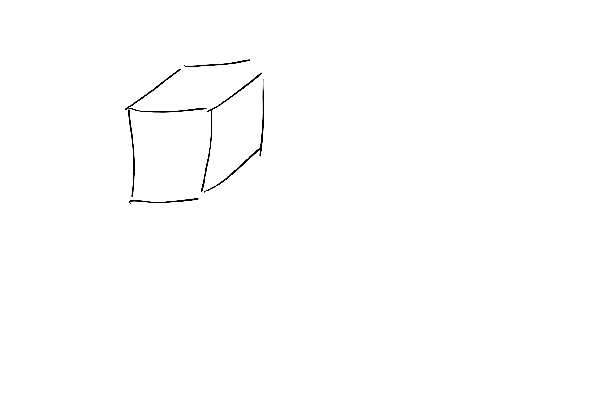

\\toc

# A title

Some intro text.

Another text with a reference mid text here[^1]

{#fig:AFigureReference}

## A subtitle
here is a reference to the figure [@fig:AFigureReference]

\\appendix

# Is this an appendix
Some intro text 

{#fig:AFigureReference2}

here is a reference to the figure [@fig:AFigureReference2]

[^1]: This is a footmark
