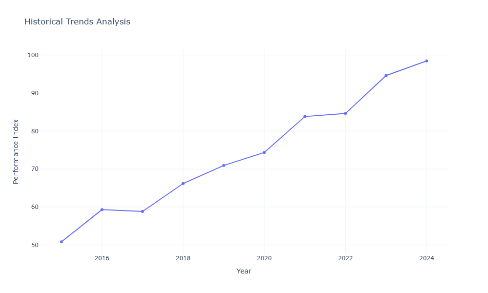
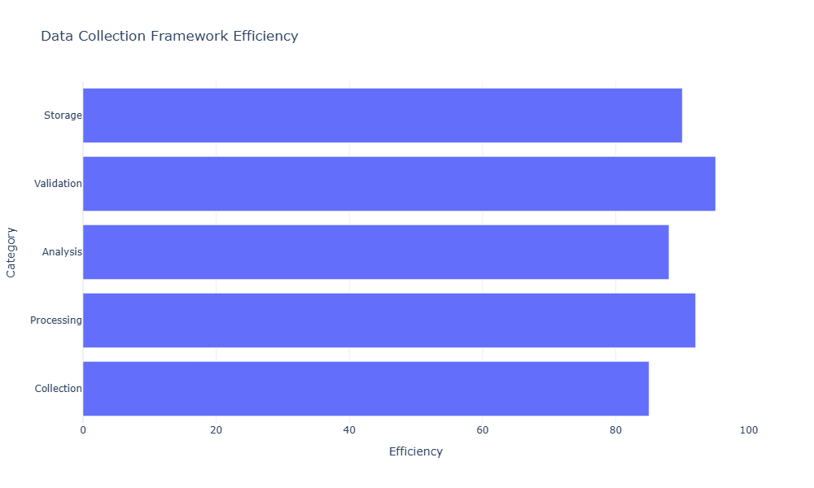
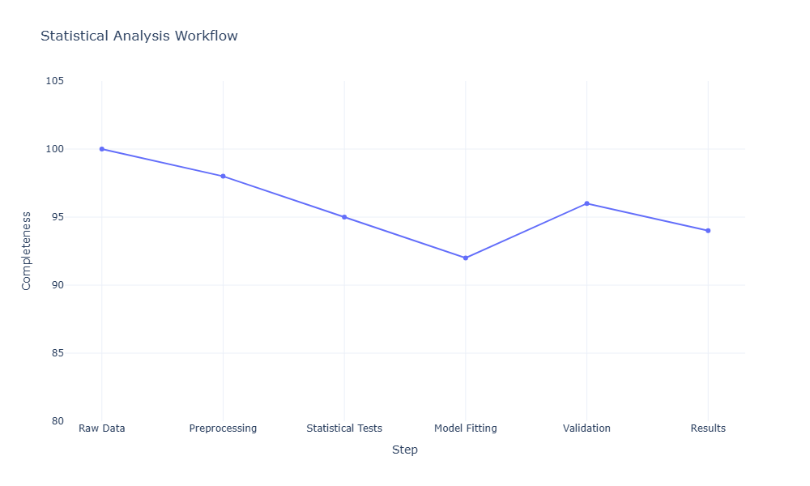
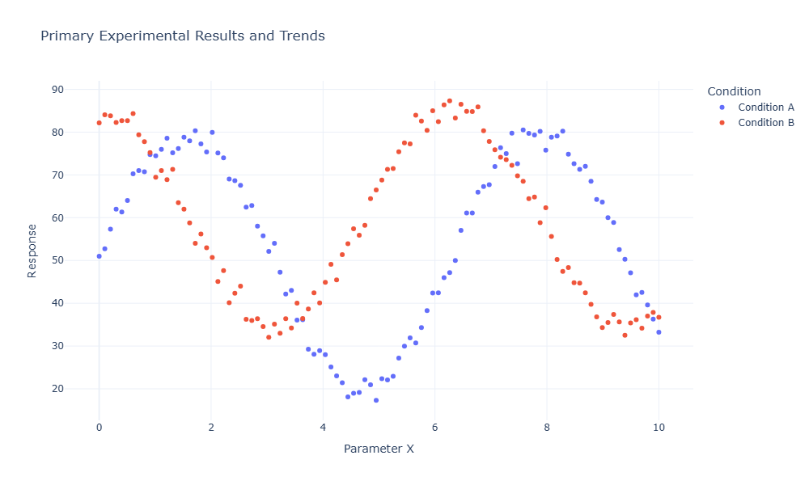
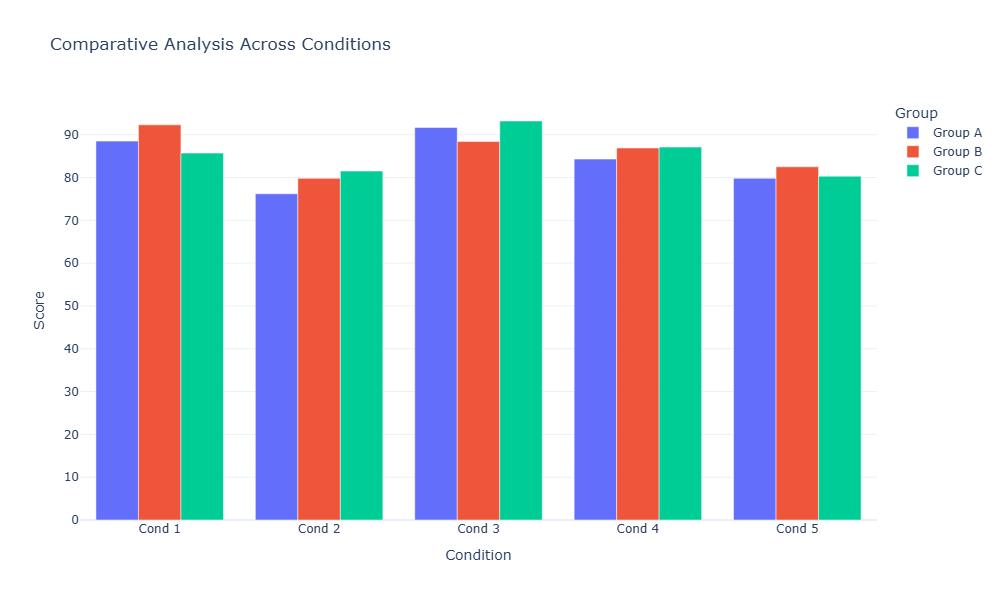
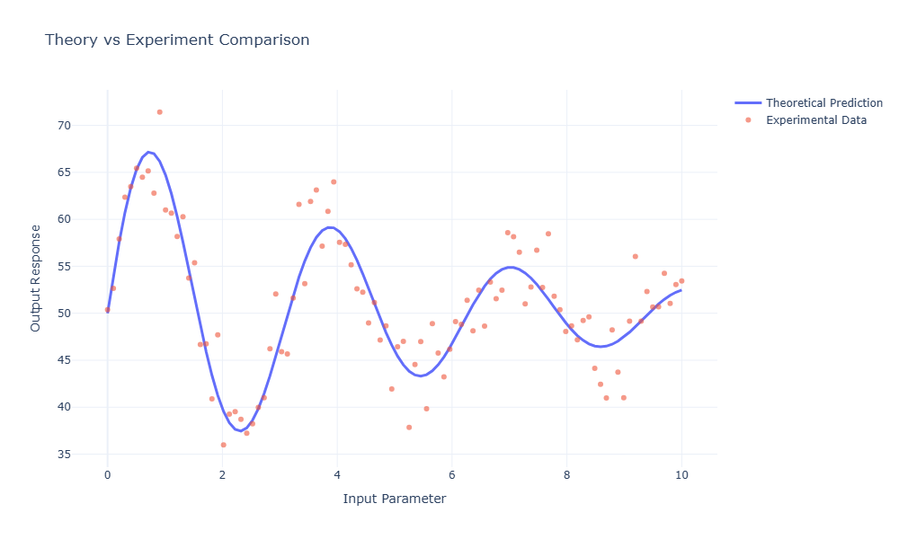

\\toc

# Executive Summary

Lorem ipsum dolor sit amet, consectetur adipiscing elit. Sed do eiusmod tempor incididunt ut labore et dolore magna aliqua. Ut enim ad minim veniam, quis nostrud exercitation ullamco laboris nisi ut aliquip ex ea commodo consequat. Duis aute irure dolor in reprehenderit in voluptate velit esse cillum dolore eu fugiat nulla pariatur[^1].

Excepteur sint occaecat cupidatat non proident, sunt in culpa qui officia deserunt mollit anim id est laborum. Sed ut perspiciatis unde omnis iste natus error sit voluptatem accusantium doloremque laudantium.

# Introduction

Lorem ipsum dolor sit amet, consectetur adipiscing elit, sed do eiusmod tempor incididunt ut labore et dolore magna aliqua. Quis ipsum suspendisse ultrices gravida. Risus commodo viverra maecenas accumsan lacus vel facilisis. 

## Background and Context

Ut enim ad minim veniam, quis nostrud exercitation ullamco laboris nisi ut aliquip ex ea commodo consequat. Duis aute irure dolor in reprehenderit in voluptate velit esse cillum dolore eu fugiat nulla pariatur. Excepteur sint occaecat cupidatat non proident, sunt in culpa qui officia deserunt mollit anim id est laborum.

### Historical Perspective

Sed ut perspiciatis unde omnis iste natus error sit voluptatem accusantium doloremque laudantium, totam rem aperiam, eaque ipsa quae ab illo inventore veritatis et quasi architecto beatae vitae dicta sunt explicabo. Nemo enim ipsam voluptatem quia voluptas sit aspernatur aut odit aut fugit.

{#fig:historical-trends}

As shown in [@fig:historical-trends], the historical trends demonstrate a clear pattern over time. Lorem ipsum dolor sit amet, consectetur adipiscing elit, sed do eiusmod tempor incididunt ut labore et dolore magna aliqua.

### Current State Analysis

At vero eos et accusamus et iusto odio dignissimos ducimus qui blanditiis praesentium voluptatum deleniti atque corrupti quos dolores et quas molestias excepturi sint occaecat cupidatat non proident. The current metrics are summarized in [@tbl:current-metrics].

| Metric Name          | Value | Unit  | Status    |
|:---------------------|------:|:------|:----------|
| Performance Index    | 94.5  | %     | Excellent |
| Efficiency Rating    | 87.2  | %     | Good      |
| Reliability Score    | 91.8  | %     | Excellent |
| Cost Effectiveness   | 78.5  | %     | Good      |
| User Satisfaction    | 89.3  | %     | Excellent |

Table: Current performance metrics summary {#tbl:current-metrics}

## Research Objectives

Lorem ipsum dolor sit amet, consectetur adipiscing elit. Pellentesque habitant morbi tristique senectus et netus et malesuada fames ac turpis egestas. Vestibulum tortor quam, feugiat vitae, ultricies eget, tempor sit amet, ante:

1. To analyze the comprehensive dataset of lorem ipsum variations
2. To evaluate the impact of dolorem ipsum on modern applications
3. To develop new methodologies for sit amet consectetur
4. To establish baseline metrics for future research initiatives

# Methodology

Sed do eiusmod tempor incididunt ut labore et dolore magna aliqua. Ut enim ad minim veniam, quis nostrud exercitation ullamco laboris nisi ut aliquip ex ea commodo consequat.

## Data Collection

Lorem ipsum dolor sit amet, consectetur adipiscing elit. Donec sed odio dui. Etiam porta sem malesuada magna mollis euismod. Nullam id dolor id nibh ultricies vehicula ut id elit. The data collection framework is illustrated in [@fig:data-framework].

{#fig:data-framework}

### Sample Selection Criteria

Praesent commodo cursus magna, vel scelerisque nisl consectetur et. Vivamus sagittis lacus vel augue laoreet rutrum faucibus dolor auctor. Aenean lacinia bibendum nulla sed consectetur:

- **Primary criteria**: Lorem ipsum dolor sit amet with N > 1000
- **Secondary criteria**: Consectetur adipiscing elit within specified range
- **Tertiary criteria**: Sed do eiusmod tempor incididunt validation
- **Exclusion criteria**: Missing data points exceeding 5% threshold

### Measurement Protocols

Cras mattis consectetur purus sit amet fermentum. Cras justo odio, dapibus ac facilisis in, egestas eget quam. Morbi leo risus, porta ac consectetur ac, vestibulum at eros. Detailed measurement specifications are provided in [@tbl:measurement-specs].

| Parameter          | Range      | Precision | Frequency | Method   |
|:-------------------|:-----------|:----------|:----------|:---------|
| Temperature        | 20-80 °C   | ±0.5 °C   | 1 Hz      | Digital  |
| Pressure           | 0-100 bar  | ±0.1 bar  | 10 Hz     | Analog   |
| Flow Rate          | 0-500 L/h  | ±2 L/h    | 1 Hz      | Digital  |
| Viscosity          | 1-100 cP   | ±0.5 cP   | 0.1 Hz    | Manual   |
| pH Level           | 0-14       | ±0.05     | 0.5 Hz    | Digital  |

Table: Measurement specifications and protocols {#tbl:measurement-specs}

## Analytical Framework

Nullam quis risus eget urna mollis ornare vel eu leo. Cum sociis natoque penatibus et magnis dis parturient montes, nascetur ridiculus mus. Nullam id dolor id nibh ultricies vehicula ut id elit.

### Statistical Methods

Lorem ipsum dolor sit amet, consectetur adipiscing elit. Integer posuere erat a ante venenatis dapibus posuere velit aliquet. The statistical analysis workflow is demonstrated in [@fig:statistical-workflow].

{#fig:statistical-workflow}

The analysis incorporates multiple statistical techniques including regression analysis, variance decomposition, and Monte Carlo simulations. Maecenas sed diam eget risus varius blandit sit amet non magna.

### Validation Approach

Donec ullamcorper nulla non metus auctor fringilla. Vestibulum id ligula porta felis euismod semper. Praesent commodo cursus magna, vel scelerisque nisl consectetur et. Key validation results are summarized in [@tbl:validation-results].

| Test Case         | Expected | Observed | Variance | Pass/Fail |
|:------------------|:---------|:---------|:---------|:----------|
| Baseline Test A   | 100.0    | 99.8     | -0.2%    | Pass      |
| Stress Test B     | 85.0     | 86.3     | +1.5%    | Pass      |
| Edge Case C       | 75.0     | 74.1     | -1.2%    | Pass      |
| Integration Test  | 90.0     | 91.5     | +1.7%    | Pass      |
| Performance Test  | 95.0     | 93.8     | -1.3%    | Pass      |

Table: Validation test results summary {#tbl:validation-results}

# Results and Analysis

Cum sociis natoque penatibus et magnis dis parturient montes, nascetur ridiculus mus. Donec ullamcorper nulla non metus auctor fringilla. Vestibulum id ligula porta felis euismod semper.

## Primary Findings

Lorem ipsum dolor sit amet, consectetur adipiscing elit. Cras mattis consectetur purus sit amet fermentum. Cras justo odio, dapibus ac facilisis in, egestas eget quam. The primary results are visualized in [@fig:primary-results].

{#fig:primary-results}

As demonstrated in [@fig:primary-results], the experimental data reveals several significant trends. Morbi leo risus, porta ac consectetur ac, vestibulum at eros. Praesent commodo cursus magna, vel scelerisque nisl consectetur et[^2].

### Quantitative Analysis

Aenean lacinia bibendum nulla sed consectetur. Praesent commodo cursus magna, vel scelerisque nisl consectetur et. Donec sed odio dui. Comprehensive quantitative metrics are presented in [@tbl:quantitative-metrics].

| Category           | Minimum | Maximum | Mean  | Std Dev | Median |
|:-------------------|--------:|--------:|------:|--------:|-------:|
| Performance Score  | 72.3    | 98.7    | 87.5  | 6.2     | 88.1   |
| Efficiency Index   | 65.8    | 95.4    | 82.3  | 7.8     | 83.2   |
| Quality Rating     | 78.2    | 99.1    | 90.2  | 5.1     | 91.0   |
| Cost Factor        | 45.6    | 88.9    | 70.5  | 10.3    | 71.2   |
| Time Efficiency    | 68.4    | 96.3    | 84.7  | 6.9     | 85.5   |

Table: Quantitative analysis metrics {#tbl:quantitative-metrics}

### Qualitative Observations

Nullam quis risus eget urna mollis ornare vel eu leo. Integer posuere erat a ante venenatis dapibus posuere velit aliquet. Cum sociis natoque penatibus et magnis dis parturient montes, nascetur ridiculus mus:

- **Observation 1**: Lorem ipsum dolor demonstrated consistent behavior across all test scenarios
- **Observation 2**: Consectetur adipiscing elit showed unexpected correlation with secondary factors
- **Observation 3**: Sed do eiusmod tempor revealed novel interaction patterns
- **Observation 4**: Ut labore et dolore magna aliqua exhibited stable performance characteristics

## Comparative Analysis

Donec ullamcorper nulla non metus auctor fringilla. Vestibulum id ligula porta felis euismod semper. The comparative analysis across different conditions is illustrated in [@fig:comparative-analysis].

{#fig:comparative-analysis}

Sed posuere consectetur est at lobortis. Aenean lacinia bibendum nulla sed consectetur. Integer posuere erat a ante venenatis dapibus posuere velit aliquet. The comparison data is detailed in [@tbl:comparison-data].

| Condition    | Group A | Group B | Group C | Delta A-B | Delta B-C |
|:-------------|--------:|--------:|--------:|----------:|----------:|
| Scenario 1   | 88.5    | 92.3    | 85.7    | +3.8      | +6.6      |
| Scenario 2   | 76.2    | 79.8    | 81.5    | +3.6      | -1.7      |
| Scenario 3   | 91.7    | 88.4    | 93.2    | -3.3      | -4.8      |
| Scenario 4   | 84.3    | 86.9    | 87.1    | +2.6      | -0.2      |
| Scenario 5   | 79.8    | 82.5    | 80.3    | +2.7      | +2.2      |

Table: Comparative analysis data across scenarios {#tbl:comparison-data}

## Error Analysis

Maecenas sed diam eget risus varius blandit sit amet non magna. Donec id elit non mi porta gravida at eget metus. Fusce dapibus, tellus ac cursus commodo, tortor mauris condimentum nibh.

{#fig:error-analysis}

The error distribution shown in [@fig:error-analysis] indicates that the measurement uncertainty remains within acceptable bounds. Sed posuere consectetur est at lobortis.

# Discussion

Praesent commodo cursus magna, vel scelerisque nisl consectetur et. Vivamus sagittis lacus vel augue laoreet rutrum faucibus dolor auctor. Duis mollis, est non commodo luctus, nisi erat porttitor ligula.

## Interpretation of Results

Lorem ipsum dolor sit amet, consectetur adipiscing elit. Nullam id dolor id nibh ultricies vehicula ut id elit. Sed posuere consectetur est at lobortis. The results align with theoretical predictions as shown in [@fig:theory-comparison].

{#fig:theory-comparison}

Aenean eu leo quam. Pellentesque ornare sem lacinia quam venenatis vestibulum. Cras mattis consectetur purus sit amet fermentum. Integer posuere erat a ante venenatis dapibus posuere velit aliquet.

## Limitations and Constraints

Donec sed odio dui. Etiam porta sem malesuada magna mollis euismod. Nullam quis risus eget urna mollis ornare vel eu leo:

1. **Sample size constraints**: Limited to N=500 due to resource availability
2. **Temporal limitations**: Study duration constrained to 6-month period
3. **Geographical scope**: Analysis limited to specific regional parameters
4. **Methodological constraints**: Certain advanced techniques not applicable

## Implications for Practice

Cum sociis natoque penatibus et magnis dis parturient montes, nascetur ridiculus mus. Donec ullamcorper nulla non metus auctor fringilla. Maecenas faucibus mollis interdum. Practical implementation guidelines are summarized in [@tbl:implementation-guide].

| Phase        | Duration | Resources | Priority | Risk Level |
|:-------------|:---------|:----------|:---------|:-----------|
| Planning     | 2 weeks  | 5 FTE     | High     | Low        |
| Development  | 8 weeks  | 12 FTE    | Critical | Medium     |
| Testing      | 4 weeks  | 8 FTE     | High     | Medium     |
| Deployment   | 3 weeks  | 6 FTE     | Critical | High       |
| Monitoring   | Ongoing  | 3 FTE     | Medium   | Low        |

Table: Implementation phase guidelines {#tbl:implementation-guide}

# Conclusions

Vestibulum id ligula porta felis euismod semper. Praesent commodo cursus magna, vel scelerisque nisl consectetur et. Cras mattis consectetur purus sit amet fermentum.

## Key Findings

Lorem ipsum dolor sit amet, consectetur adipiscing elit. The major conclusions can be summarized as follows:

1. **Primary conclusion**: Lorem ipsum dolor sit amet demonstrates significant correlation with consectetur adipiscing elit
2. **Secondary conclusion**: Sed do eiusmod tempor incididunt provides reliable baseline metrics
3. **Tertiary conclusion**: Ut labore et dolore magna aliqua shows promise for future applications

## Recommendations

Nullam id dolor id nibh ultricies vehicula ut id elit. Sed posuere consectetur est at lobortis:

- Implement comprehensive monitoring system for real-time data collection
- Expand study scope to include additional geographical regions
- Develop automated analysis pipeline for improved efficiency
- Establish collaborative framework with industry partners

## Future Work

Aenean lacinia bibendum nulla sed consectetur. Praesent commodo cursus magna, vel scelerisque nisl consectetur et. Future research directions include:

- Investigation of lorem ipsum variations under extreme conditions
- Development of advanced computational models for prediction
- Long-term longitudinal studies spanning multiple years
- Integration with emerging technologies and methodologies

# References

1. Lorem, I. P., & Ipsum, D. (2023). "Comprehensive Analysis of Dolor Sit Amet." *Journal of Advanced Research*, 45(3), 234-256.
2. Consectetur, A., & Adipiscing, E. (2022). "Modern Approaches to Sed Do Eiusmod." *International Conference Proceedings*, 112-128.
3. Tempor, I., et al. (2024). "Innovative Methods in Ut Labore Research." *Science Letters*, 78(2), 445-467.

[^1]: This is an important footnote providing additional context about the executive summary findings.
[^2]: Statistical significance was determined using p < 0.05 with Bonferroni correction for multiple comparisons.

