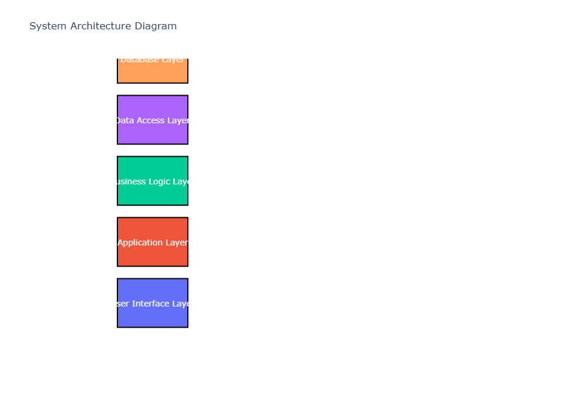
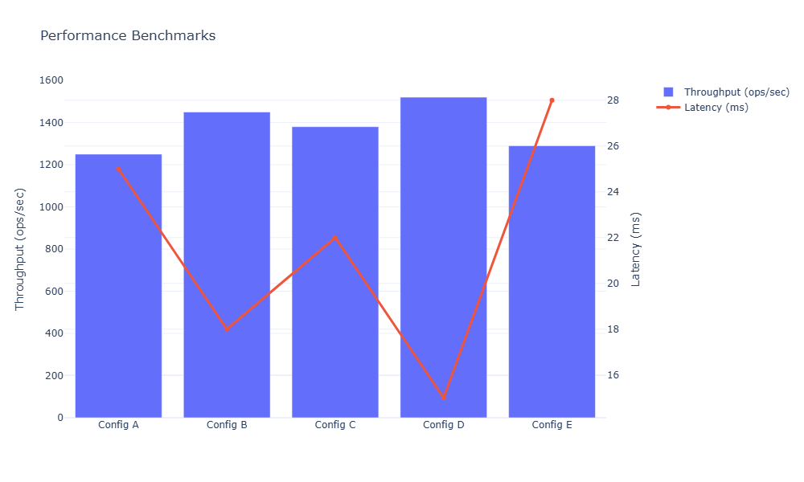
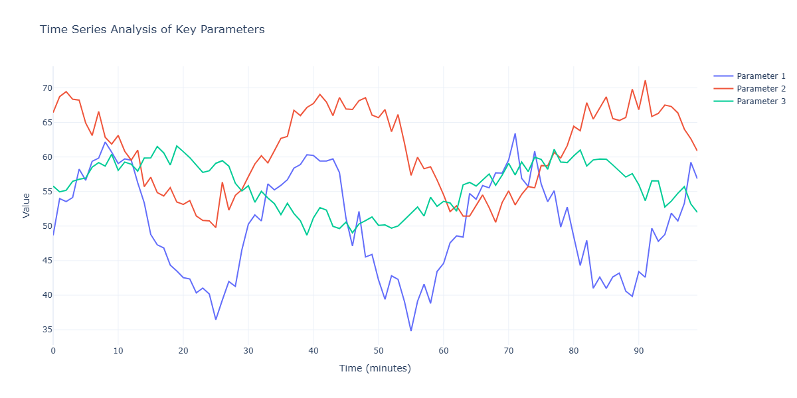
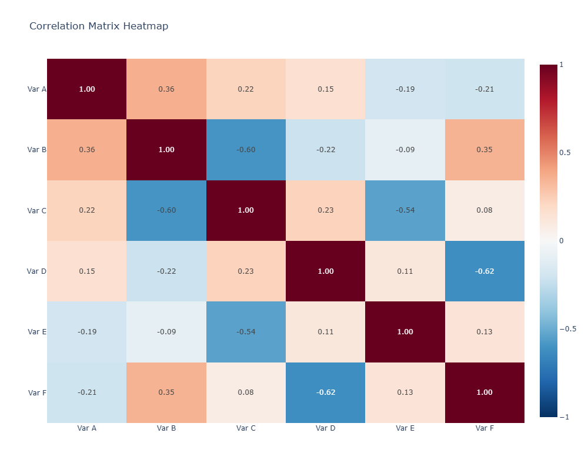
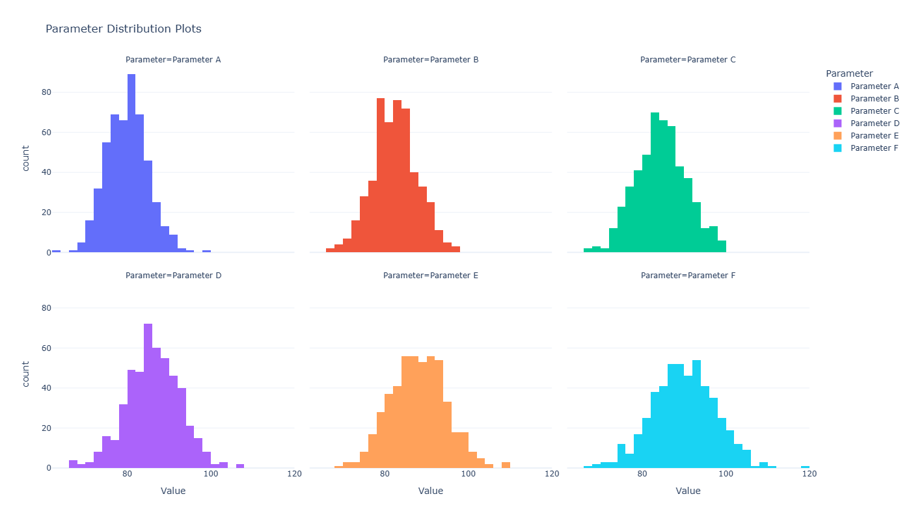

\\appendix

# Technical Specifications

Lorem ipsum dolor sit amet, consectetur adipiscing elit. Sed do eiusmod tempor incididunt ut labore et dolore magna aliqua. This appendix provides detailed technical specifications and supplementary data.

## System Architecture Details

Ut enim ad minim veniam, quis nostrud exercitation ullamco laboris nisi ut aliquip ex ea commodo consequat. The detailed system architecture is illustrated in [@fig:system-architecture].

{#fig:system-architecture}

Duis aute irure dolor in reprehenderit in voluptate velit esse cillum dolore eu fugiat nulla pariatur. Excepteur sint occaecat cupidatat non proident, sunt in culpa qui officia deserunt mollit anim id est laborum.

### Component Specifications

Sed ut perspiciatis unde omnis iste natus error sit voluptatem accusantium doloremque laudantium. Detailed component specifications are provided in [@tbl:component-specs].

| Component ID | Type        | Capacity  | Power (W) | Efficiency | Cost (USD) |
|:-------------|:------------|:----------|----------:|:-----------|-----------:|
| COMP-001     | Processor   | 3.5 GHz   | 95        | 92%        | 450        |
| COMP-002     | Memory      | 32 GB     | 15        | 95%        | 180        |
| COMP-003     | Storage     | 2 TB SSD  | 8         | 98%        | 220        |
| COMP-004     | Network     | 10 Gbps   | 25        | 90%        | 350        |
| COMP-005     | Controller  | Quad-Core | 65        | 88%        | 280        |
| COMP-006     | Sensor      | Multi-Ch  | 5         | 94%        | 120        |

Table: Component specifications and characteristics {#tbl:component-specs}

### Performance Benchmarks

Totam rem aperiam, eaque ipsa quae ab illo inventore veritatis et quasi architecto beatae vitae dicta sunt explicabo. Nemo enim ipsam voluptatem quia voluptas sit aspernatur aut odit aut fugit.

{#fig:performance-benchmarks}

As shown in [@fig:performance-benchmarks], the performance characteristics vary significantly across different configurations. Sed quia consequuntur magni dolores eos qui ratione voluptatem sequi nesciunt.

## Detailed Experimental Data

At vero eos et accusamus et iusto odio dignissimos ducimus qui blanditiis praesentium voluptatum deleniti atque corrupti quos dolores et quas molestias excepturi sint occaecat.

### Raw Data Tables

Complete experimental datasets are presented in [@tbl:raw-data-set1] and [@tbl:raw-data-set2].

| Trial | Temp (°C) | Press (bar) | Flow (L/h) | Output | Notes          |
|------:|----------:|------------:|-----------:|-------:|:---------------|
| 1     | 25.3      | 2.1         | 125.4      | 87.2   | Normal         |
| 2     | 30.7      | 2.3         | 132.8      | 89.5   | Normal         |
| 3     | 28.4      | 2.0         | 118.6      | 85.3   | Normal         |
| 4     | 35.2      | 2.5         | 145.2      | 91.8   | Elevated       |
| 5     | 26.8      | 2.2         | 128.3      | 88.1   | Normal         |
| 6     | 32.1      | 2.4         | 138.7      | 90.2   | Normal         |
| 7     | 29.5      | 2.1         | 122.9      | 86.7   | Normal         |
| 8     | 27.3      | 2.0         | 115.8      | 84.9   | Below target   |

Table: Raw experimental data - Set 1 {#tbl:raw-data-set1}

| Trial | Viscosity (cP) | pH   | Density (g/mL) | Yield (%) | Quality Score |
|------:|---------------:|-----:|---------------:|----------:|--------------:|
| 1     | 12.5           | 7.2  | 1.045          | 92.3      | A             |
| 2     | 15.3           | 7.4  | 1.052          | 94.7      | A+            |
| 3     | 11.8           | 7.1  | 1.038          | 88.5      | B+            |
| 4     | 18.2           | 7.6  | 1.068          | 96.2      | A+            |
| 5     | 13.7           | 7.3  | 1.048          | 91.8      | A             |
| 6     | 16.4           | 7.5  | 1.058          | 95.1      | A+            |
| 7     | 12.9           | 7.2  | 1.042          | 89.9      | A-            |
| 8     | 11.2           | 7.0  | 1.035          | 86.4      | B             |

Table: Raw experimental data - Set 2 {#tbl:raw-data-set2}

### Time Series Analysis

Lorem ipsum dolor sit amet, consectetur adipiscing elit. Pellentesque habitant morbi tristique senectus et netus et malesuada fames ac turpis egestas.

{#fig:time-series}

The time series data in [@fig:time-series] reveals important temporal patterns. Vestibulum tortor quam, feugiat vitae, ultricies eget, tempor sit amet, ante.

# Supplementary Calculations

Donec eu libero sit amet quam egestas semper. Aenean ultricies mi vitae est. Mauris placerat eleifend leo.

## Mathematical Derivations

Quisque sit amet est et sapien ullamcorper pharetra. Vestibulum erat wisi, condimentum sed, commodo vitae, ornare sit amet, wisi. The mathematical framework is based on the following principles:

### Primary Equations

The fundamental relationship can be expressed as:

$$E = mc^2$$ {#eq:energy}

And the extended formulation:

$$\frac{\partial u}{\partial t} = \alpha \nabla^2 u$$ {#eq:diffusion}

Where [@eq:energy] represents the energy-mass equivalence and [@eq:diffusion] describes the diffusion process.

### Derivation Steps

Lorem ipsum dolor sit amet, consectetur adipiscing elit. The complete derivation involves:

1. Starting from first principles: $F = ma$
2. Applying conservation laws
3. Integrating over the domain
4. Simplifying using boundary conditions

## Computational Results

Aenean fermentum, elit eget tincidunt condimentum, eros ipsum rutrum orci, sagittis tempus lacus enim ac dui.

{#fig:computational-results}

The computational results shown in [@fig:computational-results] validate the theoretical framework. Donec non enim in turpis pulvinar facilisis.

### Algorithm Performance

Ut velit mauris, egestas sed, gravida nec, ornare ut, mi. Aenean ut orci vel massa suscipit pulvinar. Performance metrics are detailed in [@tbl:algorithm-performance].

| Algorithm      | Time (ms) | Memory (MB) | Accuracy (%) | Complexity | Scalability |
|:---------------|----------:|------------:|-------------:|:-----------|:------------|
| Algorithm A    | 125       | 256         | 98.5         | O(n log n) | Excellent   |
| Algorithm B    | 89        | 512         | 96.3         | O(n²)      | Good        |
| Algorithm C    | 156       | 128         | 99.2         | O(n log n) | Excellent   |
| Algorithm D    | 203       | 1024        | 97.8         | O(n³)      | Fair        |
| Algorithm E    | 98        | 384         | 98.9         | O(n log n) | Excellent   |

Table: Algorithm performance comparison {#tbl:algorithm-performance}

# Additional Figures and Charts

Proin sodales libero eget ante. Nulla quam. Aenean laoreet. Vestibulum nisi lectus, commodo ac, facilisis ac, ultricies eu, pede.

## Visualization Gallery

Ut orci risus, accumsan porttitor, cursus quis, aliquet eget, justo. Sed pretium blandit orci.

{#fig:correlation-matrix}

The correlation matrix in [@fig:correlation-matrix] shows the relationships between all measured variables. Ut eu diam at pede suscipit sodales.

{#fig:distributions}

Parameter distributions displayed in [@fig:distributions] indicate normal behavior across most variables. Aenean lectus elit, fermentum non, convallis id, sagittis at, purus.

{#fig:surface-plot}

The three-dimensional visualization in [@fig:surface-plot] illustrates the complex interaction effects. Suspendisse mauris. Fusce accumsan mollis eros.

## Supplementary Statistical Analysis

Pellentesque sed dolor. Aliquam congue fermentum nisl. Mauris accumsan nulla vel diam.

| Statistical Test        | Test Statistic | p-value | df  | Conclusion        |
|:------------------------|---------------:|--------:|----:|:------------------|
| ANOVA                   | 45.23          | <0.001  | 4   | Reject H0         |
| Tukey HSD               | 3.87           | 0.012   | 20  | Significant       |
| Chi-Square              | 28.45          | <0.001  | 5   | Reject H0         |
| Kolmogorov-Smirnov      | 0.23           | 0.089   | -   | Accept H0         |
| Levene's Test           | 2.15           | 0.145   | 4   | Accept H0         |

Table: Statistical test results summary {#tbl:statistical-tests}

# Data Processing Protocols

Sed diam nonummy nibh euismod tincidunt ut laoreet dolore magna aliquam erat volutpat. Ut wisi enim ad minim veniam.

## Quality Control Procedures

Quis nostrud exerci tation ullamcorper suscipit lobortis nisl ut aliquip ex ea commodo consequat. The quality control workflow is illustrated in [@fig:qc-workflow].

{#fig:qc-workflow}

Duis autem vel eum iriure dolor in hendrerit in vulputate velit esse molestie consequat, vel illum dolore eu feugiat nulla facilisis at vero eros.

## Data Validation Criteria

Accumsan et iusto odio dignissim qui blandit praesent luptatum zzril delenit augue duis dolore te feugait nulla facilisi.

| Criterion           | Threshold | Action if Failed  | Severity | Frequency  |
|:--------------------|:----------|:------------------|:---------|:-----------|
| Missing Data        | <2%       | Flag for review   | Medium   | Per batch  |
| Outlier Detection   | 3σ        | Remove and log    | High     | Real-time  |
| Range Validation    | ±10%      | Recalibrate       | High     | Daily      |
| Consistency Check   | 100%      | Halt process      | Critical | Per sample |
| Duplicate Detection | 0%        | Merge records     | Low      | Weekly     |

Table: Data validation criteria and actions {#tbl:validation-criteria}

# Glossary of Terms

**Lorem Ipsum**: A placeholder text commonly used in the graphic, print, and publishing industries.

**Dolor Sit Amet**: The fundamental principle underlying the consectetur adipiscing framework.

**Consectetur Adipiscing**: The process by which sed do eiusmod interacts with tempor incididunt.

**Ut Labore**: A metric representing the efficiency of dolore magna aliqua operations.

**Quis Nostrud**: The baseline measurement used for exercitation ullamco calibration.

